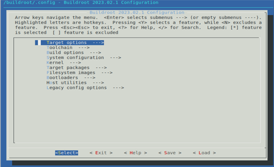
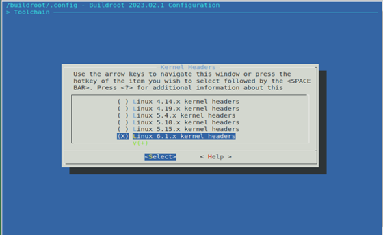
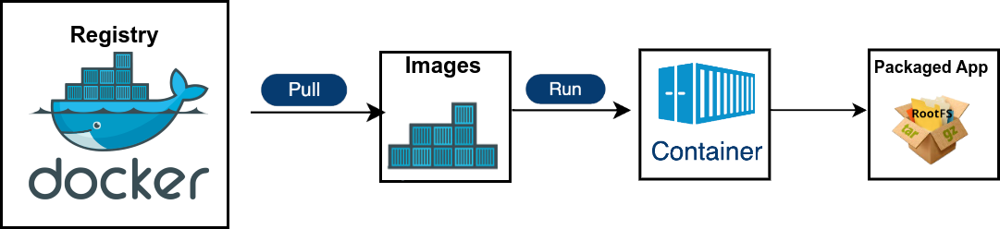

## Introduction

This guide contains step-by-step instructions on how to generate a containerized application package for the Corteca ecosystem.

### Docker

The toolchains for compiling and building the containers require docker or a compatible container engine. This document assumes that you use docker.
Make sure you have docker installed.

```shell
docker --version
```

If this fails, please follow the installation procedure for your OS.

### Corteca Toolchains

Currently there are two flavors of the Corteca Toolchain depending on the target CPU architecure

- `ghcr.io/nokia/corteca-toolchain-armv7:23.12.1`
- `ghcr.io/nokia/corteca-toolchain-armv8:23.12.1`

For our examples, we will use `corteca-toolchain-armv8` version `23.12.1`.

## Toolchain functionality

### Go to your application source code

You need to change the working directory to the path where your application resides in, e.g.:

```shell
cd sample-application
```

### Build the container package

You need to mount the container application source code om `/app/` inside the container and the default action (build) will be run.

```shell
docker run --rm -it -v ./:/app -u "$(id -u):$(id -g)" ghcr.io/nokia/corteca-toolchain-armv8:23.12.1
```

After a successful run the container package will be generated in `dist/`

### Create a custom buildroot configuration for your application

Use a toolchain image to generate the configuration file. The file will be created as `build/armv8.config`. Copy that file to the `context/config` folder with the same name as the environment file.

```shell
docker run --rm -it -u "$(id -u):$(id -g)" -v ./:/app \
    ghcr.io/nokia/corteca-toolchain-armv8:23.12.1 nokia_toolchain menuconfig
```

With these options in the docker run command the following configuration menu is provided to select additional configuration/packages/tools/utils for your image to use:

 

By navigating in the menu, you can change configuration e.g: "Kernel Headers configuration" by entering "Toolchain" option and changing the Kernel Headers configuration:



This way you can additional packages for your container by entering “Target packages” option.

### Build the App with an already created custom configuration

You need to mount your custom configuration (e.g.: `custom.config`) under `/buildroot/.config` set environment variable `REBUILD_BUILDROOT` to 'yes'.

```shell
docker run --rm -it -u "$(id -u):$(id -g)" \
    -v ./:/app \
    -v ./custom.config:/buildroot/.config \
    -e REBUILD_BUILDROOT="yes" \
    ghcr.io/nokia/corteca-toolchain-armv8:23.12.1
```

This would take longer, since buildroot will be compiled first and then your application.

#### Containerized Application Workflow


